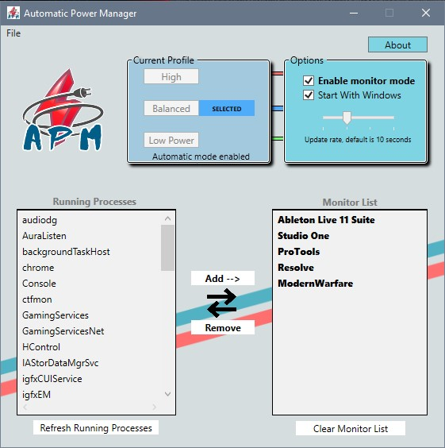

Sure! Here's the revised version with HTML bold tags added to the headings:

<b>The Automatic Power Manager for Windows 10</b> allows you to automatically switch to High Performance mode based on what apps you are running. If none of these apps are running, it defaults to Balanced Mode.

<b>How to Use:</b>

Start up APM and add a program from the running processes list to the monitor list. If your application isn't on the running list, make sure your program is running and click on the <i>refresh running processes list</i> button. Now, when you run this program in the future, your laptop will automatically switch to High Performance Mode.
(If your app is already on the monitor list, it will not show up on the running processes list.)

<b>Options:</b>

There are currently 3 options in this section.

1. <b>Monitor mode enabled or disabled:</b> Enable or disable auto switching of power profile.
2. <b>Start up with Windows:</b> This disables or enables auto startup with Windows.
3. <b>Rate Slider:</b> This chooses how fast the auto switching happens, between 5 seconds up to 20 seconds. Default is 10 seconds.

<b>Current Features:</b>

- Will switch to Low powered mode instead of Balanced when on battery power when no monitored apps are running.
- Notifications when switching between power profiles.
- Three power profiles required to function properly (Low, Balanced, and High). If any of these don't exist, the app will create the missing profiles.

<b>Example Use Case:</b>

Ableton and other apps that require real-time effects can stutter while playing the simplest of projects, even though you might have a very powerful laptop. The reason is simple: the balanced profile on your laptop will ramp up and down the CPU core clock to keep the laptop cool and efficient. When doing a task like music production, the CPU clocks shouldn't be allowed to do this ramp up or down; this is how the clips and blips happen. You can manually set your laptop to High Performance mode when doing these tasks, but you will either forget to set it up before starting a recording and probably ruin a good take or forget to set your system back to an efficient power profile like 'Balanced' when done. This app fixes that issue for you automatically.

<b>Requirements:</b> Laptop running Windows 10.

Download link below.

https://github.com/KTAppDev/Switch-Power-profile/releases/tag/1.09

To uninstall just use regular windows program uninstaller / add remove programs.

PS. The UI looks like crap, I know.

Interested in collaborating on this project please send mail to kentaylorappdev@gmail.com

